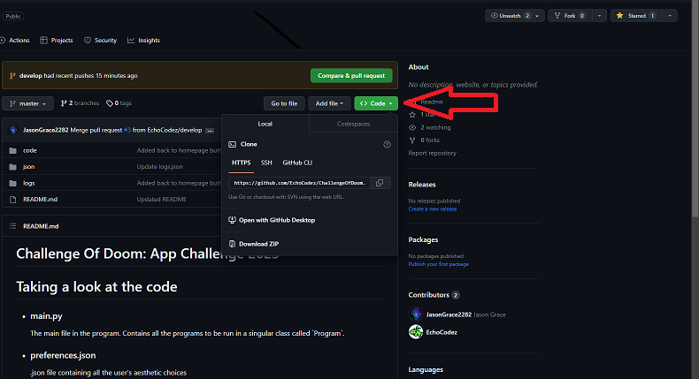
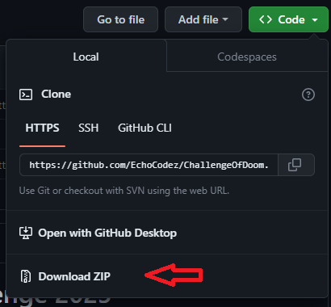
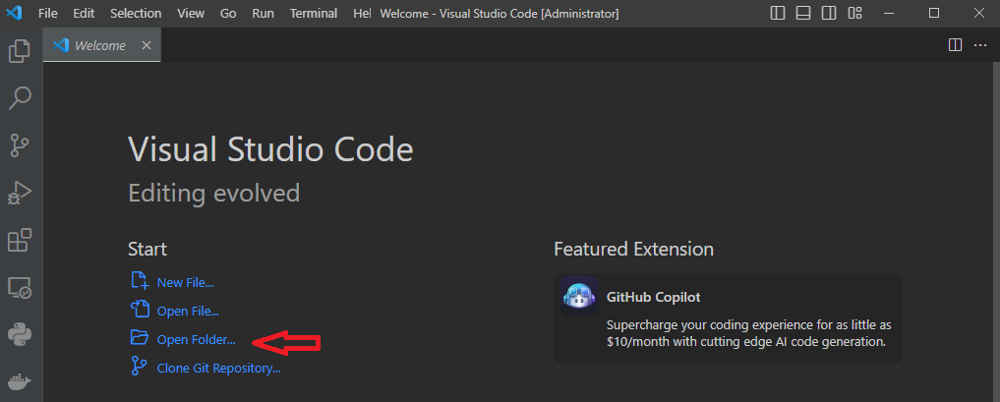
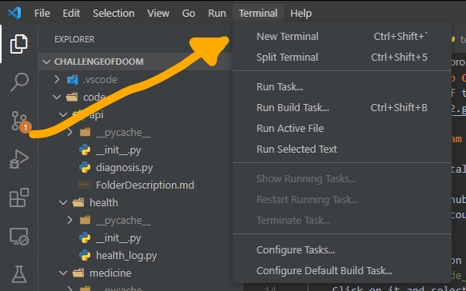

# Challenge Of Doom: App Challenge 2023
Check out the website of the creators:
- https://jasongrace2282.github.io

# Downloading the program
- To do: Use PyInstaller and InstallForge to create the builder- 
    x, y, z
- Cloning the GitHub repository
Alternatively, you could go to our GitHub repository (linked <a href=https://github.com/EchoCodez/ChallengeOfDoom>here</a>) and clone it from here.
On Windows:
Go to the code button on the top right:



Click on it and select download zip



Now navigate to the zipped file and click extract all. Remember your extracted location.


Now open a new window in Visual Studio Code (download [here](https://code.visualstudio.com/download)). Click open folder.



Click on the folder you extracted the GitHub repository too. You have officially cloned the repository!

# Running the program
1. Download python (3.10 or higher preferred) from [here](https://www.python.org/downloads/). Run the installer, and if you are on Windows, make sure to put a check on adding python and pip to your path.
2. Then open a new terminal in VSCode. In this terminal, type `pip install poetry`.
3. After poetry has finished installing, type in the terminal `poetry install`. It should install all required packages.
4. Naviage to `code/main.py` and run the `py` file. The app should now run and show you a setup scene!
5. Congratulations, you have now installed and ran the program!

# Directory Structure
```bash
.
├── .gitignore
├── README.md
├── code
│   ├── main.py
│   ├── api
│   │   └── diagnosis.py
│   ├── log
│   │   ├── health_log.py
│   │   ├── meal.jpg
│   │   └── test.py
│   ├── medicine
│   │   ├── medicine.py
│   │   └── notifications.py
│   ├── processes
│   │   ├── __init__.py
│   │   └── health_log.py
│   ├── setup
│   │   ├── __init__.py
│   │   ├── setup.py
│   │   └── setup_questions.py
│   └── utils
│       ├── __init__.py
│       ├── data_classes.py
│       ├── generic.py
│       ├── mcq.py
│       ├── parse_json.py
│       └── special.py
├── json
│   ├── conditions.json
│   ├── health
│   │   ├── 09_05_23.json
│   │   ├── 10_05_23.json
│   │   └── 12_05_23.json
│   ├── logs.json
│   ├── medicines.json
│   ├── possible_diseases.json
│   ├── preferences.json
│   ├── symptoms.json
│   └── user-data.json
├── logs
│   └── runlog.log
└── random
    ├── code_button.png
    ├── download_zip.png
    ├── extract_zip.png
    └── open_folder_vscode.png
```

# Parts and Pieces
To check out what each folder does, read its respective `FolderDescription.md`

# Data gathered by us
Rest assured that no data is gathered by our team! Every piece of info you put into this program is stored locally on your computer, so you don't have to worry about our policies regarding your personal info!

# Libraries and tools used
- Python 3.11.2
- Github
- tkinter
- customtkinter (and extensions)
- json
- os and sys
- datetime and calender
- plyer and apscheduler
- typing, io, dataclasses
- hmac, base64, and hashlib
