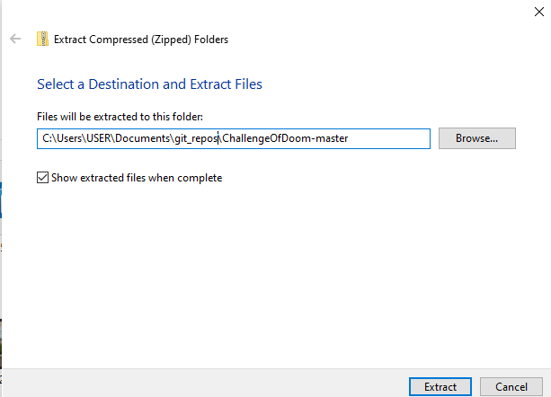

# Challenge Of Doom: App Challenge 2023

# Downloading the program
<ol>
    <li>TODO: Use PyInstaller and InstallForge to create the builder</li>
    x, y, z
    <li>Cloning the github repository</li>
    Alternatively, you could go to our github repository (linked <a href=https://github.com/EchoCodez/ChallengeOfDoom>here</a>) and clone it from here.<br>
    On windows:<br>
    Go to the code button on the top right:<br><br>
    <br><br>
    Click on it and select download zip<br><br>
    <br><br>
    Now navigate to the zipped file and click extract all. Remember your extracted location.<br><br>
    <br><br>
    Now open a new window in Visual Studio Code (download <a href="https://code.visualstudio.com/download">here</a>). Click open folder.
    <br><br>
    Click on the folder you extracted the github repository too. You have officially cloned the repository!<br>
    Note: To run the program, all you need to do now is open <code>code/main.py</code> and run it.
</ol>

# Directory Structure
```bash
.
├── README.md
├── code
│   ├── api
│   │   ├── api.py
│   │   └── diagnosis.py
│   ├── log
│   │   ├── health_log.py
│   │   ├── meal.jpg
│   │   └── test.py
│   ├── log_processes
│   │   ├── UI_health_log.py
│   │   ├── get_logs.py
│   │   └── health_log.py
│   ├── main.py
│   ├── setup
│   │   ├── __init__.py
│   │   ├── ctkcalender.py
│   │   ├── imports.py
│   │   ├── setup.py
│   │   └── setup_questions.py
│   └── utils
│       ├── __init__.py
│       ├── config.py
│       ├── data_classes.py
│       ├── mcq.py
│       ├── parse_json.py
│       └── test.py
├── json
│   ├── conditions.json
│   ├── logs
│   │   ├── 09_05_23.json # store user diagnosis results
│   │   ├── 10_05_23.json
│   │   └── 12_05_23.json
│   ├── logs.json
│   ├── possible_diseases.json
│   ├── preferences.json
│   ├── symptoms.json
│   └── user-data.json
├── logs
│   └── runlog.log
├── main.spec
├── readme
└── readme_screenshots
    ├── code_button.png
    ├── download_zip.png
    ├── extract_zip.png
    └── open_folder_vscode.png
```

# Parts and Pieces
<ul>
    <li><h3><code>main.py</code></h3>
    The main file in the program. Contains all the programs to be run in a singular class called `Program`.</li>
    <li><h3><code>utils/parse_json.py</code></h3>
    File containing class jsonUtil. Mainly used for working with json files</li>
    <li><h3><code>utils/mcq.py</code></h3>
    Home to the Multiple Choice Quiz Builder</li>
    <li><h3><code>api/api.py</code> and <code>api/diagnosis.py</code></h3>
    The files used to make calls to the APImedic api</li>
</ul>

# Libraries and tools used
<ul>
    <li>Python 3.11.2</li>
    <li>Github</li>
    <li>tkinter</li>
    <li>customtkinter</li>
    <li>json</li>
    <li>os and sys</li>
    <li>Other libraries like: typing, io, and dataclasses</li>
</ul>
